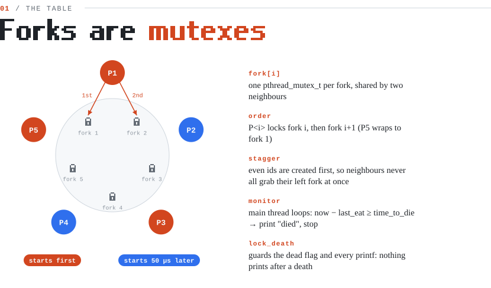
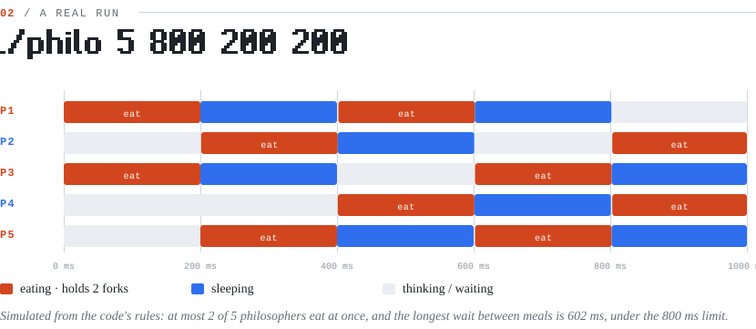
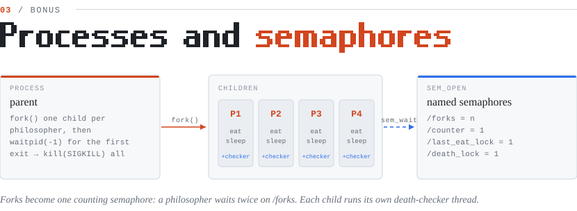

<picture>
  <source media="(prefers-color-scheme: dark)" srcset="docs/banner-dark.svg" />
  
</picture>

SyncMaster or Table of Threads in this projects i developed a simulation inspired by the "Dining Philosophers" problem to explore concurrency, race conditions, and resource management in multithreaded environments. The project required managing shared resources among multiple "philosophers" (threads) who alternated between thinking and eating. The focus was on preventing race conditions, avoiding deadlocks, and ensuring no starvation of threads. By utilizing mutexes and semaphores, I implemented efficient synchronization mechanisms to guarantee thread safety and proper resource allocation. This project significantly enhanced my skills in concurrent programming, thread synchronization, and the prevention of common pitfalls like race conditions and deadlocks.

<picture>
  <source media="(prefers-color-scheme: dark)" srcset="docs/table-dark.svg" />
  
</picture>

<picture>
  <source media="(prefers-color-scheme: dark)" srcset="docs/timeline-dark.svg" />
  
</picture>

<picture>
  <source media="(prefers-color-scheme: dark)" srcset="docs/bonus-dark.svg" />
  
</picture>

## Run it

```bash
cd philo && make
./philo 5 800 200 200        # philosophers, time_to_die, time_to_eat, time_to_sleep (ms)
./philo 5 800 200 200 7      # optional: stop once everyone has eaten 7 times
cd ../philo_bonus && make && ./philo_bonus 5 800 200 200
```

<sub>Diagrams in <code>docs/</code> are generated SVGs, drawn to match the code in this repo.</sub>
